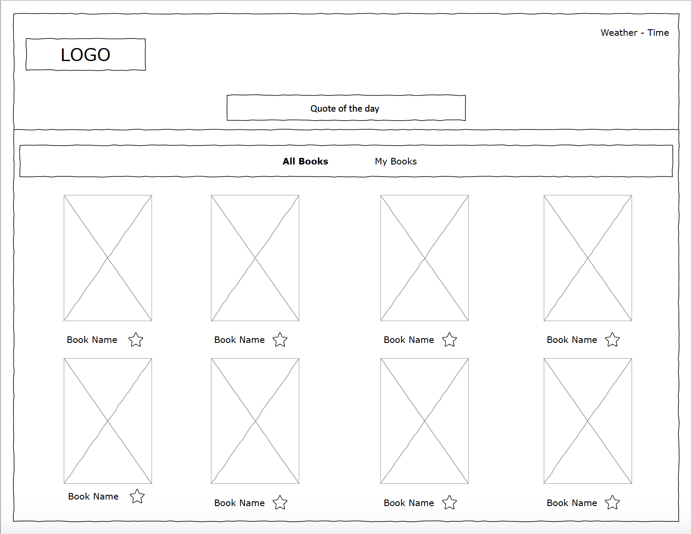
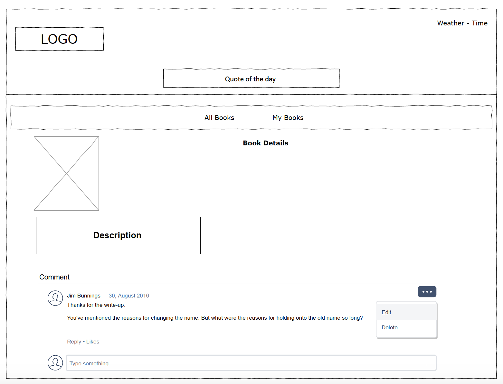

# Readers website (Project2)
Readers is application used to display books from Goole book API and search for books, built with React, Javascript and CSS. 

# Project status 
The project status is completed. Users can search for books, add books to favorite (My Books tab) and can add/edit/remove comments.

## Features
* User can view the date/weather and quote of the day
* User can search a book
* User can add book to the favorites
* User can delete one book from favorites
* User can delete all books from favorites
* User can add/edit/remove comment 
* Responsive design 

## Future Golas 
1. User login and sign up.
2. Save the data to local Storage.

## Installation
```bash 
$ git clone https://git.generalassemb.ly/MaryamBalabeed/Project2.git
$ cd Project2
$ install npm 
$ npm install axios
``` 
## Start 
``` 
$ npm start
```

# Languages & tools
* HTML
* JavaScript (React Framework)
* CSS 
* Bootstap toolkit 
* Visual Studio 
* iTerm terminal
* Chrome browser

## APIs Used 
1. Google books API
    * https://developers.google.com/books 
2. Weather API
    * https://openweathermap.org/api
3. Quote API
    * https://forismatic.com/en/api/

# Code Blocks 

Get Books data from API 
```
  // function to get the books data from api
  getbooks = (e) => {
    // api for home page
    let bookAPI = `https://www.googleapis.com/books/v1/volumes?q=pride`;

    // api for search result with input
    if (this.state.filter === "search") {
      console.log("button clicked");
      bookAPI = `https://www.googleapis.com/books/v1/volumes?q=${this.state.searchedBook}`;
    }

    axios
      .get(bookAPI)

      .then((response) => {
        //infoLink ==> the link of online book
        console.log(response);
        const mainData = response.data.items;
        this.setState({ allData: mainData });

        this.setState({ searchedBook: "" });
      })
      .catch((err) => {
        console.log("Error: ", err);
      });
  };
```
Edit a comment
``` 
  // update the comment
  updateComment = (NewVlue, comment) => {
    console.log("update", NewVlue);
    const commentArray = this.state.commentArray;
    const commentIndex = commentArray.indexOf(comment);
    commentArray[commentIndex] = NewVlue;
    this.setState({ commentArray: commentArray });
  };
```
   
# Wireframe 






# Screenshot

* Home page 

 |
| ----- |


* Home page 2 

| 
| ----- |


* Comment Box

 |
| ----- |


* My books tab 

|
 | ----- |
